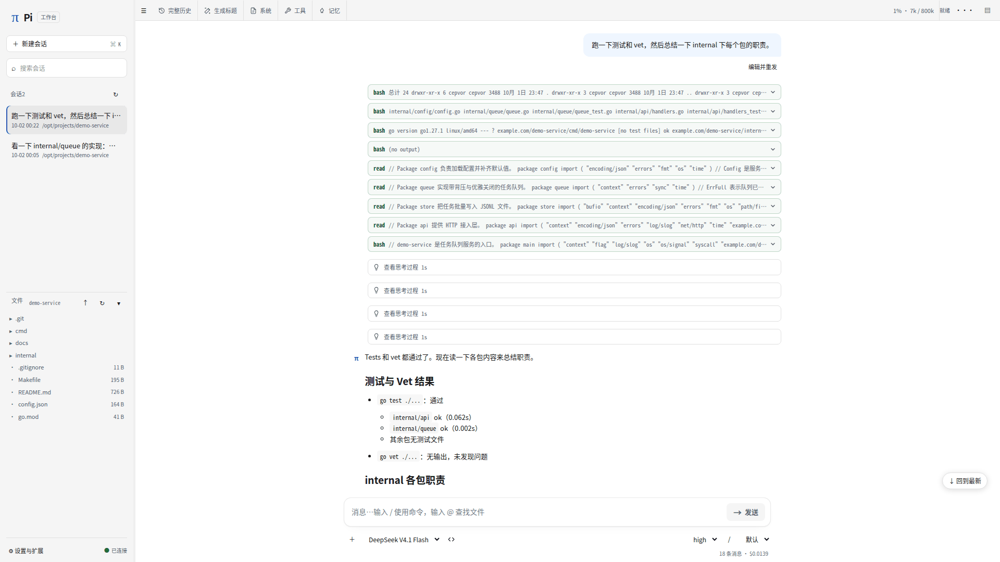
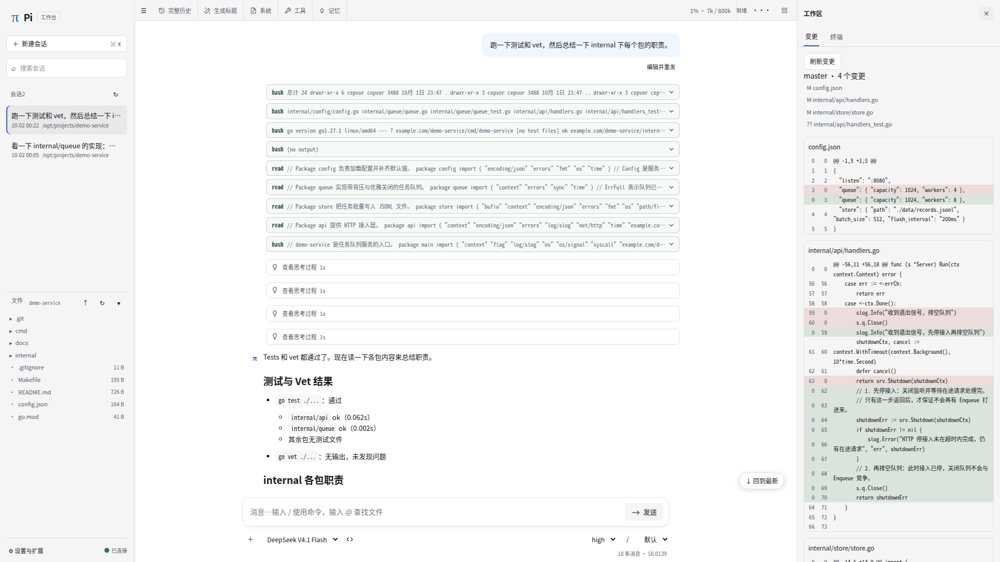
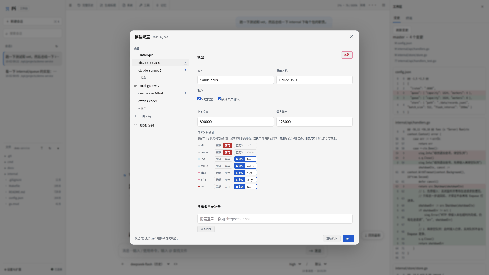
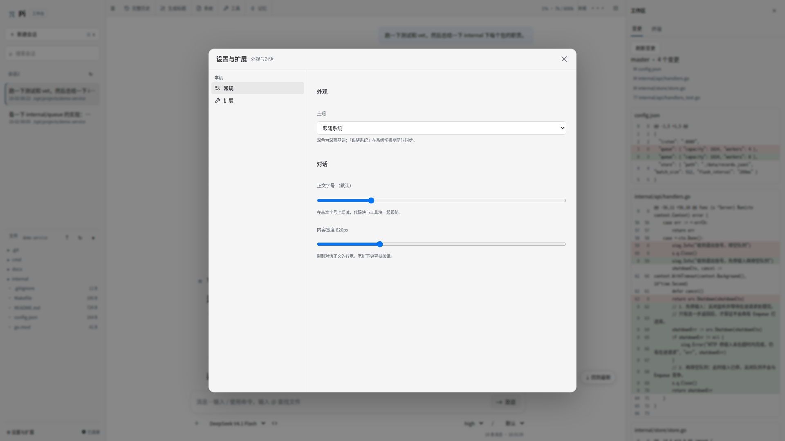

# Pi Bridge

自托管的 **Pi 工作台**：一个 Go 桥 + 一个 HTMX 前端。

桥通过子进程驱动 `pi --mode rpc`，把会话、工具调用、终端与工作区文件直接渲染成
HTML 片段推给浏览器。**不嵌入 Pi SDK，不复制会话数据**——会话正文始终以 Pi 的
JSONL 文件为准。

```
浏览器  ⇄  桥（Go）  ⇄  pi --mode rpc 子进程
             │
             └─ 读取 Pi 的 JSONL / 只读 Magic Context 的 SQLite
```

## 界面



*对话工作台：会话列表与文件树、工具调用与思考块各自折叠、回合用量。*



*工作区面板：只读 Git 变更视图；同一面板还提供文件预览与终端。*



*模型配置：供应商/模型两级树、能力与限额、思考等级映射、按模型目录补全。*



*设置与扩展：主题、字号、内容宽度，以及已安装扩展清单。*

## 能做什么

- **会话工作台**：会话列表与搜索、历史分页、分支切换、消息流（思考块与工具调用各自折叠）、实时流式输出、中止与继续
- **模型与工作区**：图形化编辑 `models.json`（供应商/模型两级树、思考等级映射、连通性测试）、文件树与预览、只读 Git 变更视图、终端面板
- **扩展、记忆与主题**：已装扩展清单、Magic Context 记忆面板（只读浏览、分类与项目筛选）、5 套主题与字号/行宽调节
- **多端接入**：本机直连、反向代理（网关终止 TLS）、云端中转（relay）三种形态，同一份产物自适应

## 快速开始

需要已安装 [Pi](https://github.com/earendil-works/pi)（可执行 `pi --mode rpc`）、
Go 1.27+、Node.js ≥ 20.19 与 pnpm 11。

```bash
# 1. 构建前端
cd pi-webui-htmx
pnpm install --frozen-lockfile
pnpm build                      # 产出 dist/，桥会从这里读资源

# 2. 启动桥
cd ../pi-bridge-go
export PI_BRIDGE_TOKEN="$(openssl rand -hex 32)"
go run ./cmd/pi-bridge \
  --workspace "$HOME/projects" \
  --pi "$(command -v pi)" \
  --ui-dir ../pi-webui-htmx \
  --state-dir "$HOME/.local/state/pi-bridge"

# 3. 打开 http://127.0.0.1:30142 并粘贴上面的令牌
```

首次使用时模型列表是空的——桥默认使用**隔离的**配置目录，不会读取你真实的
`~/.pi/agent`。用 `--agent-dir "$HOME/.pi/agent"` 直接沿用现有配置，或在界面里
点输入栏右侧的 `<>` 按钮编辑模型。

完整说明（选项、首次配置、部署形态、安全边界）见 **[桥的 README](pi-bridge-go/README.md)**。

## 设计原则

- **会话数据只有一份**：Pi 的 JSONL 是正文、工具结果与分支的唯一权威；桥只读、不复制，改它的只有 Pi 自己
- **浏览不启动进程**：列表、历史、文件浏览都只读磁盘；只有发消息或显式恢复会话才拉起 `pi` 子进程
- **断线不等于取消**：命令被接受不等于完成；结果未知时不自动重发；浏览器断开不影响已受理的任务
- **工作区是授权目录，不是沙箱**：`--workspace` 限定网页能碰的范围，但 Pi 工具与终端以**你的用户身份**运行
- **凭据只留在桥所在的机器上**：模型 API Key 不发送到浏览器，网页也不能新增命令型凭据表达式
- **不可信内容不升级信任**：模型输出、文件内容与会话标题一律经转义与净化后渲染

## 文档

| 文档 | 内容 |
|---|---|
| [桥 README](pi-bridge-go/README.md) | Go 桥：安装、启动、选项、首次模型配置、部署形态、刻意不做的事 |
| [协议 v1](pi-bridge-go/api/v1/protocol.md) | 入口、方法、事件与限额 |
| [桥开发说明](pi-bridge-go/docs/DEVELOPMENT.md) | 桥：设计边界、代码结构、不变量、测试、限制 |
| [前端开发说明](pi-webui-htmx/docs/DEVELOPMENT.md) | HTMX 前端：目录结构、技术栈、职责边界、样式、常见坑 |

## 测试

```bash
cd pi-bridge-go && go vet ./... && go test -race ./...   # 19 个包
cd pi-webui-htmx && pnpm test && pnpm check             # 单测 + 类型 + 产物与契约

# 跨目录契约测试（模板、方法清单与桥的实现对照）需同时指出 UI 包：
# PI_WEBUI_DIR=../pi-webui-htmx go test -race ./...
```

## 技术栈

| | |
|---|---|
| 桥 | Go 1.27，标准库优先；外部依赖只有 **3 个**（brotli 压缩、coder/websocket、creack/pty），无 CGO，可纯静态构建 |
| 前端 | HTMX + Go 模板服务端渲染；TypeScript 仅做交互增强——**没有前端框架、路由、状态库** |
| 构建 | Vite 8 + TypeScript 7；样式使用自有 reset 与手写 CSS（模板里没有 Tailwind 工具类） |
| 浏览器侧依赖 | htmx、marked、highlight.js、KaTeX、DOMPurify、mermaid、xterm、ansi_up；除 htmx 外全部按需动态加载 |
| 要求 | Pi 可执行 `pi --mode rpc`（开发基准 0.85.1）；Go 1.27+；Node ≥ 20.19 与 pnpm 11 |

## 许可证

**AGPL-3.0-or-later**（见 [LICENSE](LICENSE)）。依赖组件各自遵循其原许可证，与 AGPL-3.0 兼容。

**界面设计与 CSS 样式来源于 [pi-web](https://github.com/agegr/pi-web)**（MIT，Copyright © 2026 agegr）：
五套主题的调色板（浅色 / 深色 / 雾蓝 / 蔷薇 / 松绿）、布局尺寸与组件观感均以它为基准移植。
差异在渲染方式——本项目用 Go 模板 + htmx 在服务端出 HTML 片段，而不是浏览器端组件。
其版权与许可声明见 [THIRD-PARTY-NOTICES.md](THIRD-PARTY-NOTICES.md)。

⚠️ **一处边界**：前端构建产物含一个 **EPL-2.0** 的传递依赖（`mermaid` → `elkjs`），与 GPL/AGPL 系列不兼容。
分发源码（本仓库现状，`dist/` 不入库）无影响；分发构建产物前需先移除 mermaid 或排除该 chunk。

AGPL 第 13 节：通过网络对该软件提供服务的一方，需向使用者提供对应版本的完整源码。
