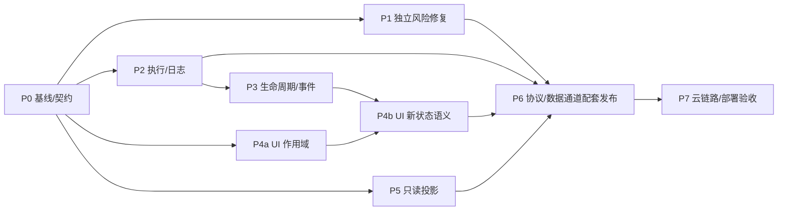

# 整体修复实施规划

更新：2026-09-27。**P0 已完成本地验收；P1 实施中；P2–P7 待实施，当前协议仍为 v1。** 基线与入口分类见 [method-inventory.md](method-inventory.md)。

P1 已完成配置秘密/安全写入/供应商请求、受限 Git runner 与子进程环境过滤；台账记录逐项状态。当前两仓联测通过，前端 73 项测试，首屏 36.63 KiB gzip。P1 的 HTTP/包查询/relay 独立边界仍在推进，尚未将整批标为完成。 [architecture.md](architecture.md) 的 S01–S12 定义技术决策，[code-audit.md](code-audit.md) 保存 105 个台账编号与主要归属；本文补充依赖、跨模块影响、迁移和交付边界，不另立第二套问题编号。

## 1. 修复原则与最终形态

保留 Go 桥、独立 Pi RPC 进程、Pi JSONL、HTMX/TypeScript 和现有内容库。修复的中心是统一事实来源与资源所有权：

```text
本地 HTTP / WS ─┐
                ├─ 鉴权上下文 + 共用准入 ── 只读服务 ── 有界文件索引/资源读取
relay/tunnel ──┘                       └─ Executor ── 持久请求记录
                                              └─ 固定目标/生命周期协调 ── Pi / PTY / 配置

浏览器：设备/连接状态 + 会话视图作用域 + 独立工作区/配置草稿
        HTTP 片段/大内容，WS 小命令/事件；所有响应在修改状态前确认归属
```

彻底修复的判据：同一根因只保留一个权威实现，所有入口都使用它，旧逻辑和绕行入口同步删除。不能只修 WS 而留下 HTTP 回执、下载或 tunnel 绕过；也不能用无限缓冲、静默兼容或扩大超时掩盖错误。

不把已有代码全部推倒：先提取共用编排、保留现有业务分发；以完整行为为提交单元，机械移动与语义变更分开。保留现有有效保护，例如 URL 级 beforeSwap 检查，待共用守卫生效后才删除重复部分。

## 2. 本轮对照源码后补齐的关键约束

| 当前代码证据 | 若照原方案直接改的风险 | 本规划决定 |
|---|---|---|
| storage.Receipt 只有 requestId/sessionId/method/outcome/at | 无法凭旧回执补出主体、指纹或原返回值；新格式强行按正常记录导入会产生假成功/重复派发 | 旧记录导入为保守去重记录；不推算缺失事实，见迁移节 |
| serveWS/virtualConn 在返回响应后才 recordReceipt；rejected 由错误码名单推断 | 执行已发生但返回 limit/error 时，错误码不能证明“没执行” | 明确记录派发阶段；只有执行器确认尚未派发才可判 rejected |
| BridgeClient 对所有 ok 响应直接 resolve(data) | `{duplicate:true}` 会被误当 WorkerInfo 等业务结果 | 区分请求状态与业务结果；没有可信业务结果就要求对账，不伪造 T |
| terminal.input 每约 10 ms 批量发输入 | 给所有有副作用命令都加 Sync，会把终端变成高频写盘路径 | 持久变更、控制、临时输入分别建模，不承诺 PTY 输入跨重启重放 |
| Rebind 在 Pi 命令返回后更新 Worker.id；event 用当前 id 标记事件 | 切换中的事件可能串会话；若全部封锁，又会卡死切换中的插件确认框 | 普通会话投影暂停，操作对话仍按稳定 worker/transition 归属送达 |
| Workbench 已有 generation 与 history/dialog 的 URL 级 beforeSwap 守卫 | 再局部加 if 容易重复，且仍挡不住 A→B→A、同会话分支竞争和 HX 响应头 | 共用 beforeOnLoad 守卫，并保留面板序号/目标复核 |
| ModelsEditor 不绑定 session；Workspace.setCwd 才关闭终端 | 把全部模块绑到 SessionScope 会在切聊天时误丢全局配置草稿或误关终端 | 设备、连接、会话、工作区、配置编辑各有明确作用域 |
| scanCache 目前只缓存一个 map，页面可持有其引用 | 扩大缓存后只统计“在缓存中”的内存会漏掉被读者持有的旧索引 | 缓存、构建、在用旧版本一起计费；先保留小容量，不先引复杂 LRU |
| /ui/* 直接读 Store/Files；HTTP ui-response 直接调 worker | 只统一命令分发仍有未受限/未协调的 HTTP 路径 | 共用准入和类型化服务，HTTP 不通过回环 WS 调用自己 |

源码入口：`internal/transport/{server,tunnel}.go`、`internal/storage/receipts.go`、`internal/runtime/{manager,identity,dialogs}.go`、`internal/sessions/{cache,lazy}.go`；UI `src/modules/{bridge,workbench,workspace,terminal,models}.ts`。

## 3. 状态与资源只交给一个所有者

以下名称是设计角色，优先在现有包中落文件，不要求逐个创建新 package。

| 所有者 | 唯一负责 | 不负责 |
|---|---|---|
| transport 的 Peer/Connection | 认证身份、连接代次、单 writer、发送预算、订阅 attachment | 命令执行寿命、Pi 进程寿命 |
| transport 的 MethodSpec/Executor | 方法分类、准入、请求指纹/claim、执行阶段、请求查询与回执 | 重新实现 Store/Manager/Config 的业务 |
| storage 的 Journal | 版本化 intent/终态、可靠写盘、恢复与保留窗口 | 会话正文、秘密、逐按键输出 |
| runtime.Manager/Worker | 稳定进程身份、目标租约、身份事务、epoch、对话、退出 | HTTP/WS 连接和磁盘历史缓存 |
| sessions.Store 的只读视图 | 已验证文件代次、偏移索引、标题/历史/树/lazy 读取 | 启动 Pi、猜 Pi 活跃叶子、写 JSONL |
| terminal.Manager / management.Config | 各自的进程/配置状态及预算 | 因浏览器重连重复创建资源或覆盖新配置 |
| 浏览器作用域 | 用户意图、草稿、DOM 和组件资源 | 推断 unknown 已执行/未执行、代替服务端去重 |

锁约定：锁内只做快照/状态转换；不能持有 Manager、Worker、Connection 锁等待磁盘 Sync、RPC、网络写入或另一资源 Close。摘资源后锁外取消/等待；跨对象用预留 token 和版本复核完成提交。Journal 写入可串行，但不能回调 Manager。统一顺序与 race/死锁测试同时落地。

## 4. 命令分类：可靠性不能伤害交互

MethodSpec 中分开定义执行类别、持久策略、目标规则、超时/预算和结果投影；“是否有副作用”不是唯一布尔量。

| 类别 | 典型操作 | 存储/重试/取消规则 |
|---|---|---|
| 只读 | state、文件/历史、配置视图、目录 | 不写持久回执；有界并发，调用方离开后可取消读取 |
| 连接资源 | subscribe/unsubscribe、attachment | 归 Connection，内存关联；Close 自动解除；不因重连回放旧订阅 |
| 持久变更或一次性执行 | prompt、steer/follow-up、bash、fork/clone/switch/new、配置写/删除、终端创建 | claim→预留→可靠 intent→派发→可靠终态；重复请求不重复执行 |
| 控制 | abort、stop、终端关闭、扩展取消 | 保留有界准入及 stdin 通道；存储故障不能堵住安全停止；固定原目标，不自动改投新 worker |
| 临时输入/最新状态 | terminal.input/resize | 内存关联和有界顺序；输入不自动重发，断线说明未知；resize 可合并为最新值，不逐条 Sync |
| dialog 回复 | ui_response | 由 `(worker实例, transition/epoch, dialogId)` 做一次性 claim 与写入确认；不阻塞于普通写日志队列 |

- 每个已有方法都必须有显式策略；不认识/未分类的方法不能绕过准入直接执行。构建/契约检查核对注册表、分发、TS 与 manifest，避免新增方法继承一个不合适的默认策略。
- 重复判定在方法规范化后进行；使用受限 typed 参数和明确默认值，不能用未经验证的原始 JSON/不稳定 map 顺序作指纹。指纹格式有版本，秘密只参与摘要、不入日志。
- 主体来自接入层，clientId 只是连接路由，不能作为授权/去重主体。当前本地是单 owner；relay 信封只含 from/data，不能假装已有可信多用户元数据。上线多主体前，必须把主体/设备绑定到已认证隧道，不从浏览器 params 接受。
- RequestID 去重的原始目标保持不变；fork 结果 sessionId 另存为结果引用，不能拿新 ID 改写原指纹。资源回执只存允许的小型 ID/版本，不存 prompt、base64、配置值和任意结果体。
- 等待超时、错误码、socket 关闭不能决定“是否已派发”。派发成功指进入受控执行边界，不等于 agent 任务完成；Pi 后续错误仍走事件。
- 只有 live intent 必须保留到执行结束/恢复归档；崩溃遗留会转成已记录的 unknown，按明示保留策略处理。unknown 过期也不允许客户端推断可安全重发，避免“永远保留全部 unknown”耗尽有界日志。
- 所有重复等待者也占有限资源；重复请求不再占一份业务执行槽。control 有容量保留，但并非无上限，输入/心跳也不能挤掉它。

## 5. 身份变更、对话与事件必须一起收敛

一次身份变更：固定 WorkerRef → 预留源/目标或 transition 槽 → 记录 intent → 调 Pi → 核验真实身份 → 提交绑定/新 epoch → 确认与新订阅。

1. transition 期间拒绝该 worker 的普通新变更，仍读取 Pi stdout、接受取消/状态对账。不能拿全局锁等待 Pi。
2. 不确定归属的普通消息不写入旧会话投影；只允许有界临时保留，容量不足标记 resync。提交后重新读持久投影，不能无界缓冲直到切换完成。
3. 插件确认可能是 `new_session` 等返回的前置条件。对话按稳定 worker+transition+dialog 传递并回到同一 worker；源视图仍可应答，不能因新 sessionId 未知而丢掉它，也不能绑定到后来选中的会话。HTTP 与 WS 回执都调用同一服务。
4. Pi 标准扩展回复没有另一条业务 ACK。写入成功只能说明桥已交给 stdin，UI 使用“已发送回复”语义，不保证插件已处理；队列拒绝保留 pending，超时/部分写入显示不确定并等待收敛。
5. 对账发现 Pi 已变身份但注册提交失败：保持隔离/unknown，不能恢复原 sessionId 的普通写入口。fork 已创建的文件也不为了“回滚”而删除。身份重新确认、运行收敛后可以恢复新的请求，但 `agent_settled` 或 get_state 的 idle 不能把旧 Journal unknown 改成成功或未执行；运行态与历史请求结论分别维护。
6. start/delete 使用同一会话预留；删除失败不变成永久删除。退出按 worker 对象/实例清全部索引，旧退出回调不能删除新进程。
7. replay 与 live 注册同一临界区完成；先输出订阅确认再 replay/live。**当前 Workbench.subscribe 尚未消费确认中的身份数据**；实现时客户端必须处理确认并建立订阅状态，未激活的订阅不直接派发业务事件，必要暂存也有界。不能只改服务器 writer，再让旧 EventCursor 继续从任意事件猜 epoch。

这一组跨 `runtime/identity.go`、`manager.go`、`dialogs.go`、`pi/client.go`、本地/tunnel 订阅和 UI EventCursor；不能在这些层各维护一套身份判断。

## 6. UI 作用域细分，避免修串会话却破坏其他面板

| 作用域 | 切换条件 | 保留/释放规则 |
|---|---|---|
| DeviceScope | 服务来源/设备/认证主体变化 | 重建连接与设备能力，隔离全部配置/终端/会话资源 |
| ConnectionGeneration | WS 重连 | 废弃旧回执/订阅，不丢当前草稿和视图选择 |
| ViewScope | 会话/新草稿变化，包括 A→B→A | 固定目标，取消旧读并屏蔽迟到响应；已受理任务仍在原目标执行 |
| 面板请求序号 | 同会话分支、文件、搜索、补全查询变化 | 最后请求获准更新 DOM；不使其他面板或整条发送链失效 |
| WorkspaceScope | cwd 变化 | 延续当前“换 cwd 关闭旧 PTY”的行为；必须确认关闭，失败保留旧 terminalId 供清理，不能静默丢掉资源 |
| ConfigEditorScope | 设备或编辑文档/revision 变化 | 切聊天不丢全局模型草稿；关闭弹窗后迟到回执不改新弹窗 |

发送快照包括文本、模型/思考意图、destination、附件和目标；读回只更新权威状态。附件从 draft 交给已受理请求时转移租约，ViewScope dispose 不得删除任务仍需使用的上传文件。新会话绑定真实 ID 时保留原 draft 身份，不能误判为用户另选了会话而吞掉本次发送。

htmx 统一在 beforeRequest 关联作用域、beforeOnLoad 阻止过期响应头/内容处理、beforeSwap 复核目标及 OOB；不能只是用 URL 相等判断。所有迟到错误、finally 恢复按钮、toast、focus、history.pushState 也要过守卫，不能只守成功结果。

组件重复绑定/卸载、blob URL、ResizeObserver、xterm、timer 用同一 disposer 习惯管理。派发后切换不调用业务 abort；只销毁视图读取和呈现资源。

## 7. 只读索引、大内容与资源预算的联动

- 冷扫描完整验证行并建不可变小索引；热读复用。标题、历史、lazy、树、导出都沿同一个已打开文件/代次读取，不把最新路径 Stat 与旧 fd 偏移拼一起。
- cache key 包含文件身份和变更信息，遇到替换/截断失效；强校验模式的成本单列。保持 JSONL 格式不变，不回写修复 Pi 文件。
- 限额覆盖缓存、在途构建、仍被请求持有的旧索引；同代次构建共享有界任务，一个等待者取消不能杀掉其他等待者的读取。先复用当前小缓存，容量扩大须由多会话测量支撑。
- 树采用平面分页，游标绑定文件代次/分支；变化后返回明确失效。不能将 Pi 的内存树直接塞进 HTTP 来规避 WS 限额，那仍可能先撞死 8 MiB RPC client。
- 上传先校验并预留配额，发送前核算完整 Pi JSON 编码长度，转交后由 Executor 释放租约。上传成功不是 prompt 已接受；用 owner/设备/draft/内容身份校验引用，不能使用任意文件路径。
- HTTP 的 history、thinking、图片、导出、上传同样受共用准入；读服务已取得配额时下层不再重复占同一 semaphore，避免嵌套等待死锁。
- Go 导出是独立格式，不宣称与 Pi 原生 HTML 字节等价；验收用户/助手/工具/思考/分支内容和转义，不只测“生成了 HTML”。命名/链接采用资源 ID，完成/取消/重启均有清理。
- 包查询、Git/文件索引、全文搜索统一遵守总量/并发/时间预算，返回 truncated/reason；不能把当前假完整输出换成另一个静默截断。

## 8. 分批实施与依赖

下面是落地批次 P0–P7，替代早期粗粒度 0–4 顺序。S 编号继续表示问题领域，P 编号只表示施工批次；一个领域可分多个闭环提交。

| 批次 | 交付内容 | 依赖与边界 | 必须通过的验收 |
|---|---|---|---|
| P0 基线与契约 | 固定两仓配套版本、整理可执行反例、修 T01 夹具隔离、补 CI；列出 62 方法及 HTTP 入口的类别/预算/目标表 | 起点；不先改协议版本或广播未实现能力 | 原基线通过；反例准确失败；两 checkout 并行测试无夹具覆盖 |
| P1 独立高风险修复 | 同一配置 walker/秘密恢复/安全临时写、禁止凭据重定向与远程新增执行表达式；Git runner；HTTP 编码/Vary；relay TTL/反代/连接上限等独立边界 | P0；每项在原模块完整关闭；token 迁移需 bridge/relay 同提交组；生命周期相关删除留给 P3 | 保存重排不丢 key，失败不破坏原文件；helper 不执行；qvalue/identity 矩阵；TTL/授权测试 |
| P2 共用执行与请求记录 | P2a 抽 MethodSpec/Executor/Peer/Connection，接通所有入口；P2b 版本化日志与原子 claim；P2c 方法超时、控制预算、请求对账和失败语义 | P0；与 P1 可部分并行，但同一 dispatch/Journaling 接入串行。原业务 handler 尽量不改 | 本地/tunnel 相同请求只派发一次；磁盘满/半行/轮转/崩溃恢复；读/控制不中断；TTY 输入无逐批 Sync |
| P3 生命周期闭环 | 稳定 worker/terminal 实例、身份/删除预留、epoch/replay、transition 中对话、幂等停止、所有 attachment 回收 | P2 的目标/阶段/Peer 约定；Go 与 EventCursor/对话 UI 配套 | 忙状态切换拒绝；Pi 已切身份但回执丢失；切换时插件确认；退订 race；满队列仍可取消；退出归零 |
| P4 前端作用域与意图 | P4a scopes/草稿/附件预留/面板序号/htmx 守卫；P4b 接 P3 的确认、unknown/resync、队列语义、资源 dispose 与流式批量 | P4a 可在 P0 后独立推进；P4b 等 P2/P3，不能提前模拟新 epoch/回执 | 每个 await 切换、A→B→A、同会话换分支；模型/草稿不被回读覆盖；没有串会话 toast/关闭/跳转 |
| P5 共用只读投影 | 文件代次与索引、标题/lazy/平面树/搜索预算、Git/文件流式上限、缓存内存计费 | 与 P2–P4 内部实现可并行；HTTP 准入接 P2，模板/字段与 UI 成对合入 | 50 MiB、同 size/mtime 替换、坏行、并发追加、深树、取消与慢读；只读 0 worker |
| P6 接口与数据通道合并发布 | HTTP 上传/资源/导出；revision+秘密操作；模型字段编辑/catalog；完成 v2 协议/模板/TS/工具配套切换 | P1–P5；不在 v1 下静默换形状；字段表单仅消费既有配置服务，不再另写一套校验 | 编码临界点、文件/图片大响应不断 WS、导出 0 worker、并发保存冲突/继续编辑、老客户端明确拒绝 |
| P7 relay 整链与部署验收 | 持久用户/设备迁移、可信主体路由、同源 HTTP+WS 隧道、分块/credit/取消、统一发布物、systemd/cgroup 与整机故障测试 | P2–P6；relay 身份存储可提前独立开发，云端产品能力最后放行 | HTTPS 反代、重启凭据、撤销活连接、多个设备隔离；上传/片段/WS/下载全通；受管崩溃后代归零 |



允许的并行是职责分离后的叶子模块工作，不是同时大改 server.go/workbench.ts。P2/P3 的入口和状态机由同一条集成线推进；每个提交组都能在隔离环境运行，不留下“新实现已加但旧分支仍被调用”。

## 9. 跨代码影响矩阵

| 改动 | 直接修改位置 | 容易连带影响的位置 | 必须保住的行为 |
|---|---|---|---|
| MethodSpec/Executor | transport server/tunnel 与新共用文件 | main 装配、observe 标签、HTTP 回执、capabilities、smoke-client | 指标只数一次，未知方法不扩大标签；控制不中普通操作饥饿 |
| Journal/请求状态 | storage、transport 执行阶段 | BridgeClient 超时、fork/start 的返回 ID、运维回滚 | 不返回假业务成功、不自动重发、不把内容/密钥写日志 |
| worker 身份事务 | runtime manager/identity/process | Store 查找/删除、订阅、扩展缓存、前端 URL/分支 | 文件头是身份依据；普通读取不启动 worker |
| Connection/replay | transport、runtime Subscription、events | PTY attachment、tunnel pump、前端 EventCursor | 断线只断传输，不杀已受理 agent；旧 close 不删新连接 |
| dialog 写入确认 | pi client writer、runtime dialogs | worker busy/idle、HTTP/WS 回执、扩展模板、fixture | 无需回执事件不进 pending；人工确认能在 transition 中完成 |
| 索引/投影 | sessions scan/cache/index/metadata/lazy | presentation Turn/Step、branch.ts、scroll.ts、搜索与导出 | 每块绑定真实 entryId；分页无重复；图片/思考不进首屏正文 |
| 大内容/临时资源 | transport HTTP、workspace、上传/导出服务 | 附件、终端输出引用、relay、鉴权/压缩、Journal 指纹 | 不绕过权限和总预算；view 释放不能删执行中的资源 |
| 配置 revision/秘密 | management config/discovery/packages | models.ts、配置表单、Pi 自己的 models.json 读取 | Pi schema 不变；已有本机表达式能保留，网页不新增执行面 |
| UI scopes | workbench/bridge 与面板模块 | htmx OOB/headers、动态库加载、快捷键、滚动与移动面板 | 配置独立于聊天；cwd 关闭 PTY 的失败不丢 ID |
| Git runner | workspace git/index | 文件 @ 补全、diff 投影、进程环境/取消 | 不执行 helper，禁用转换可能与本机原生 diff 展示不同，需明确说明 |
| relay 持久化/路由 | relay/tunnel、main、协议 envelope | 本地主体命名、凭据撤销、basePath/静态资源/CSRF | 主体来源可信；退出/撤销关闭全部渠道；不转任意 URL |
| 压缩/资产 | presentation、HTTP writer、打包加载 | HEAD/304、图片/下载、CSP、浏览器动态 import | Content-Encoding 与字节一致；模板和资产是同一代发布物 |

S01→P2，S02/S03/S08→P2–P4，S04→P1/P6，S05→P5，S06→P6，S07→P4，S09→P1/P7，S10→P1/P5，S11→P1/P4/P5，S12→P0/P6/P7；105 个台账仍沿原主要归属追踪，不靠批次完成自动关闭整组问题。

## 10. 协议、配置和持久状态迁移

### 10.1 协议与两仓配套

**决定：完整修复版集中升为 v2。** 订阅确认、请求状态、配置 revision/秘密操作及资源引用会改变语义，继续全部塞进 v1 兼容分支成本更高。P1–P5 中能保持现有形状的修复按 v1 验证；P6 才同时改变 protocolVersion、URL、manifest、TS、fixture、smoke 工具和 relay 协商。

- P2–P5 的新增内部语义先由接口/配套测试验证；能无歧义保持现有形状的才接入 v1。无法映射的新结果/对话/订阅语义留到 P6 配套发布，不以“可选字段”之名让旧客户端误判成功。
- 同一个 Executor/Store/Manager，序列化/版本边界集中于适配器；不维护两套业务实现。
- 发布时默认只启用修复版写入口；老写协议明确拒绝并提示升级。若确有旧读取需求，只加有期限的只读适配，不回落到旧盲写/旧去重路径。
- Bridge/UI 使用配套 release 标识和不可变资源目录；旧标签页发现版本不匹配后保留本地草稿，停止发新写命令并提示重载。
- 默认模型/UI 表单字段等不从“缺字段”猜新版能力。改变错误码、重复响应或对话/树形状时，TS 解码器与调用方同步更新，不能强制 cast 成旧类型。
- 云 basePath 通过统一 URL 构造传给所有模板/模块，覆盖 hx-get、导出链接、图片、CSS 字体、动态 import 和重定向；限制可转发响应头及重写规则，不只替换 BridgeClient 的 WS URL。

### 10.2 Journal 迁移和降级

- 一个 state-dir 同时只有一个写者。离线停止服务后，读取旧完整日志，验证→转换到新版本独立目录→Sync→原子切换版本标记；保留只读备份，重复执行迁移幂等。
- 旧记录缺少主体/指纹：保守阻止该 requestId 再派发，不按同 ID 的新参数猜等价；缺返回结果则查请求状态/资源状态。旧 rejected 缺可靠派发阶段，也不能无条件当作可重试。
- 旧系统已丢失的记录无法恢复；新的保证起点和实际保留边界明确发布，不能把迁移描述成补上历史 exactly-once。
- 终态只保留允许的结果引用；当前资源已结束时不宣称其仍活着。活跃 intent、unknown、成功/失败和资源存活是不同维度。
- 新版已经接受副作用后，**不能恢复旧日志快照并启动旧二进制**，否则会遗忘已执行命令。回滚优先到能理解新 Journal 的兼容构建；否则停止写入、对账后人工处理，不能以清空日志恢复服务。

### 10.3 配置、会话与 relay 状态

- Pi JSONL 和 models.json 仍是 Pi 格式。只读索引可丢弃重建；上传/导出可按租约/TTL清理；Journal 与用户/设备凭据不能当缓存丢弃。
- 配置 revision 由实际原文件字节派生，秘密引用绑定原 revision/稳定 provider/model/header 身份；改名/移动不明时要求明确操作，不猜 key 归属。保存前比较磁盘，冲突返回当前 revision，保留浏览器草稿。外部非合作 writer 的限制保持明示。
- `!command`/环境引用原样保留但不在 discover/test 执行；后者需要用户新填合法凭据或受限已有凭据引用。代理/本地模型端点采用本机授权策略，修 SSRF 不得一刀切断合法私有 API。
- relay 旧用户令牌仅在内存，进程退出后不能从哈希/设备列表反推恢复。迁移先检查可迁移字段，无法保留的认证明确重发/重新配对；不能伪造 owner 或沿用未知凭据。用户、设备、归属、撤销与 token 必须以一个可靠提交发布，不能分别写盘后留下半配对状态。
- Cookie/设备认证方式升级会使旧登录失效，作为明确升级行为记录；新版本默认不再接受 URL token 作为兼容回退。

## 11. 关闭顺序与资源压力

停止接收新请求/上传 → 关闭入口及 attachment → 在期限内收敛已受理任务/worker/PTY，未确认操作归 unknown → Executor 停止并可靠写终态 → 关闭 Journal → 释放 Store/资产等读资源。各 Close 幂等；不能先关日志再让执行器写回执。控制路径在收敛阶段仍可用。

systemd unit 的停止期限覆盖内部收敛预算，由服务管理器回收整个 cgroup；逐 worker 强隔离属于受委派子 cgroup 的独立实现，不将单个 Pdeathsig 写成整树保证。手工启动、同 UID 恶意进程、不合作外部 CLI 的限制继续保留。

每一阶段监控：worker/PTY/连接/订阅/计时器数、在途/等待数、队列字节、日志/暂存占用、缓存与在途索引内存、unknown/degraded、各类读取延迟和事件省略数。指标使用固定方法/错误类别，不以 requestId/sessionId/路径作为无界标签。

## 12. 验收、提交与完成定义

每个行为提交至少包含：复现条件、正式回归测试、产品修改、调用方/协议/文档同步、通过证据和剩余边界。跨仓修改以配套提交组验收，不能只用新模板配旧桥测绿。

| 验收层 | 必需场景 |
|---|---|
| 基线 | Go vet/race、前端单测/类型/构建/契约；使用真实 UI 包的 Go 渲染测试 |
| 阶段故障 | intent前后、stdin部分写、终态/rename/Sync失败、超时与断线、磁盘满、日志轮转/半行、恢复重启 |
| 并发顺序 | 相同ID跨连接；读/取消与身份变更；双回复；start/delete；A→B→A和同会话面板乱序；旧close晚于新连接 |
| 业务闭环 | 发送/排队/取消、首次模型、fork、切换时插件确认、配置保存中继续输入、PTY输入和cwd关闭失败 |
| 规模与清理 | 50 MiB冷/热历史、深树、超大单轮/文件/图片、100次切换/展开、慢客户端、大目录、取消上传与导出、子孙进程 |
| 双部署与发布 | 本地/relay同套场景；HTTPS反代、设备隔离、重启/撤销、旧新版本错配、状态迁移及可恢复停机 |

反例若原断言不正确，应先纠正证据而非修改产品迎合测试。U17/U18 的基本跨会话路径已有 URL 守卫，新增测试应针对代次、同会话竞争和响应头时序，不能继续称为完全没有守卫。

正确性先于旧性能数字：完整 JSON 验证可能增加冷扫描时间，必须与同一 50 MiB 夹具比较冷/热时延、分配和峰值内存；不以整体放大缓存/队列掩盖退化。40 KiB 首屏预算保留，新增管理/大内容模块尽量惰性加载。PTY 输入不得新增逐批同步写盘。

自动化与浏览器使用隔离假 Pi/临时状态；必要真实 Pi 仅做无模型调用的握手/恢复/退出验证。成功基线不能替代故障与影响面测试。

✅ 一个条目完成：正确反例转绿、相关入口及调用方全部迁移、重复旧路径已删除、契约/指标准确、压力后资源回落、受影响回归通过。⚠️ 仅写完新代码/仅文档完成/仅单测通过都不算交付。